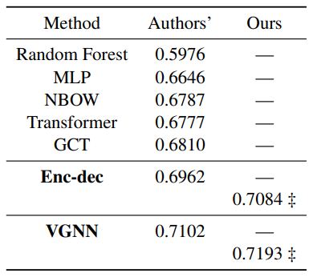

# CS598 Deep Learning for Healthcare Reproducibility Project

## Project Overview
The purpose of this project is to reproduce the research reported in  [Variationally regularized graph-based representation learning for electronic health records](https://doi.org/10.1145/3450439.3451855).

### General Problem
Electronic Health Record (EHR) data contains many sparse medical codes and concepts, making the task of building graphs from the data  challenging and computationally expensive. The paper we chose to reproduce aims to improve the graph structure learning of EHR data by regularizing node representations and adaptively learning connections between medical codes (Zhu and Razavian, 2021).

### New Approach
The new approach described in the paper is to define an architecture for building graphs of EHR data that can be generalized on different datasets. The goal is to learn the structure without explicit links, so the model is easier to apply to different datasets. This approach is further improved by introducing a layer of variational regularization, which addresses some deficiencies of GNNs acting on sparse data.

The work is innovative for addressing insufficiencies in state-of-the-art models. In prior work, the Transformer model is said to have difficulty learning attention weights from EHR data without guidance. The Graph Convolution Transformer (GCT) model demonstrated impressive performance on EHR data, but required the input of pre-defined medical ontologies. The work of this paper demonstrates superior performance to both of these methods, as well as classical methods like CNN and RNN.

## Implementation

The [official source code](https://github.com/NYUMedML/GNN_for_EHR) for the model and training was provided by the authors (Zhu and Razavian, 2021). We have modified and extended this code in order to reproduce this work and investigate the effect of regularization on model performance.

## Code execution

The following commands initiate preprocessing with the dataset-specific preprocessing scripts, and training with train.py. When training, model performance is evaluated at the end of every epoch, unless the `--eval_freq` argument is used.

### Dataset Preprocess:

MIMIC-III
```
python3 /data/mimic/preprocess_mimic.py --input_path /mimic-data/ --output_path /data/mimic/
```

eICU
```
python3 /data/eicu/preprocess_eicu.py --input_path /eicu/data/ --output_path /data/eicu/
```

### MIMIC-III Dataset

Enc-dec model
```
python3 train.py --data_path /data/mimic/ --embedding_size 768 --dropout 0.4 --batch_size 10  --var False --result_path /training_results/mimic/Enc-dec/
```

VGNN model
```
python3 train.py --data_path /data/mimic/ --embedding_size 768 --dropout 0.2 --batch_size 10  --var True --var-scale 1 --result_path /training_results/mimic/VGNN/
```

### eICU Dataset
Enc-dec model
```
python3 train.py --data_path /data/eicu/ --embedding_size 128 --dropout 0.5 --batch_size 32 --var False --result_path /training_results/eicu/Enc-dec/
```

VGNN model
```
python3 train.py --data_path /data/eicu/ --embedding_size 128 --dropout 0.4 --batch_size 32 --var True --var-scale 1e-7 --result_path /training_results/eicu/VGNN/
```

### Config File Usage:
A configuration file may be passed as a command line argument. 

```
python3 train.py --config_path ./config.yaml
```
[Example Configuration File](./config.yaml)


## Notebook

We have provided a [Jupyter Notebook](./notebook_bonus.ipynb) with examples of a typical training workflow.


## Pretrained Models

Pretrained Models from our experiments are available at the following links:

- [MIMIC-III Models](https://drive.google.com/drive/folders/1HWs3q6DTzEs6hKMHjejgsTSiL7Vuoi7j?usp=sharing)
- [eICU Models](https://drive.google.com/drive/folders/13dbwFnL9ouxkMFcVrEl0-A0h3JSlsGHU?usp=sharing)

## Results
The following tables summarize the performance of the Enc-dec and VGNN models on the MIMIC-III mortality prediction and eICU readmission prediction tasks. Units are in AUPRC. For some results, we used hyperparameters that deviate from those reported in the paper in order to reduce memory, or to optimize performance. These are indicated by the double-dagger symbol.

### Mortality with MIMIC-III Dataset


### Readmission Prediction with eICU Dataset
 

## References

Zhu, W., & Razavian, N. (2021, April). [Variationally regularized graph-based representation learning for electronic health records](https://doi.org/10.1145/3450439.3451855). In Proceedings of the Conference on Health, Inference, and Learning (pp. 1-13).


Choi, E., Xu, Z., Li, Y., Dusenberry, M. W., Flores, G., Xue, Y., & Dai, A. M. (2019). [Graph convolutional transformer: Learning the graphical structure of electronic health records](https://arxiv.org/pdf/1906.04716.pdf). arXiv preprint arXiv:1906.04716.


## Demonstration Video

[Available on YouTube](https://youtu.be/LFLJMnoj0mg)

## Team

| Author           | Email                   | Contribution
|------------------|-------------------------|------------
| Sean Enright | seanre2@illinois.edu  | Coding, Documentation, Demo
| Charles Stolz    | cstolz2@illinois.edu    | Coding, Documentation, Demo
